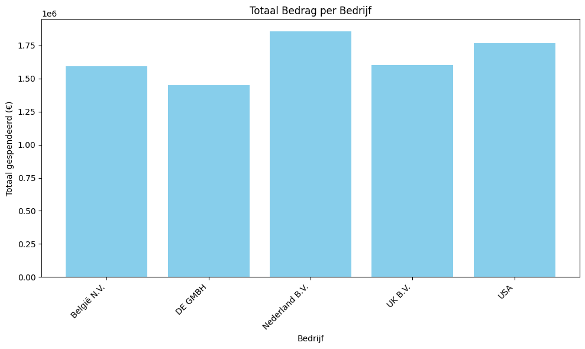
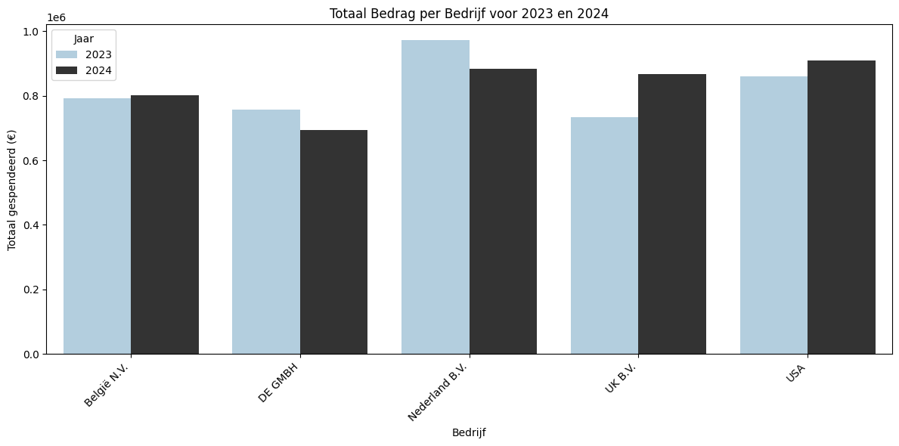

# Analyse met Python 🐍👨‍💻

In dit document presenteren we een overzicht van de bestedingen van verschillende bedrijven, met een vergelijking tussen de jaren 2023 en 2024. En nog meer in de toekomst! 

## 🏢 1. Totaal Bedrag per Bedrijf 🏢

De eerste grafiek toont het totaalbedrag dat elk bedrijf heeft uitgegeven in 2023 en 2024. De x-as toont de verschillende bedrijven, terwijl de y-as het totaalbedrag in euro's weergeeft. De grafiek vergelijkt de bestedingen van elk bedrijf tussen deze twee jaren. Dit helpt ons te begrijpen welke bedrijven de grootste uitgaven hebben en hoe deze uitgaven zich tussen de jaren verhouden.

**📊 Visualisatie 1:**  

## 2. Verhouding van Bestedingen per Jaar 💰

In de tweede visualisatie hebben we een staafgrafiek die de uitgaven per jaar toont, met aparte staven voor 2023 en 2024. Door de jaren naast elkaar te plaatsen, kunnen we snel het verschil in uitgaven per bedrijf en per jaar zien. Dit biedt inzicht in de trends van de bestedingen en hoe ze van 2023 naar 2024 zijn veranderd.

**📊 Visualisatie 2:**  

---

## Samenvatting 📝

- **Top bedrijven**: De bedrijven met de hoogste uitgaven worden duidelijk zichtbaar in de grafieken.
- **Trends in bestedingen**: De vergelijking tussen 2023 en 2024 laat zien of de uitgaven zijn gestegen, gedaald of constant zijn gebleven.
- **Toekomstige analyse**: Op basis van deze gegevens kunnen verdere trends en analyses worden uitgevoerd, bijvoorbeeld door meer gedetailleerde vergelijking van kwartaal- of maandelijkse gegevens.

---

**Let op**: De grafieken zijn fiktief